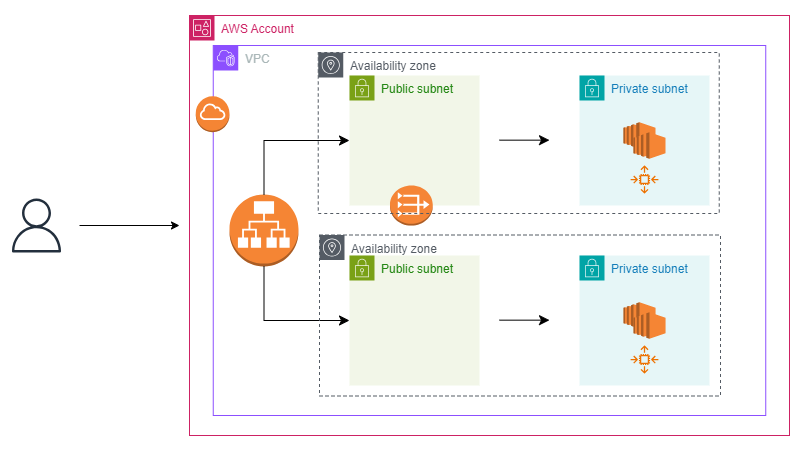

# A two-tier architecture for a single-page application

The purpose of this project is to quickly deploy a simple, two-tier architecture in the AWS cloud for a single-page application using IaC. This architecture reflects best practices when deploying an Application Load Balancer that’s open to the internet as per [AWS Prescriptive Guidance](https://docs.aws.amazon.com/prescriptive-guidance/latest/load-balancer-stickiness/subnets-routing.html). The solution is written in HCL, Terraform's language.

The components involved are the following:

* VPC
* EC2
* Auto-scaling group (ASG)
* Application load balancer (ALB)
* Security groups

## Architectural diagram



## Usage
This code assumes that you have already Terraform installed locally. For instructions on how to install Terraform, please refer to Hashicorp's documentation [here](https://developer.hashicorp.com/terraform/install).

1) Clone the repository locally:

```
https://github.com/nick22d/webapp.git
```

2) Navigate into the repository:

```
cd webapp/
```

3) Run the following commands in the order written:

```
terraform init
```

```
terraform apply --auto-approve
```

4) Verify functionality by browsing to the DNS name of the ALB returned in the output with the command below:

```
`curl http://<dns name of the ALB>`
```  
